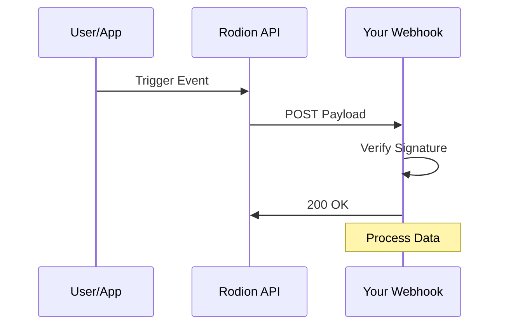

## Overview

Connect Rodion Mostovoi to your favorite tools like Slack, GitHub, and Zapier. Use webhooks for real-time event notifications or API endpoints to sync data programmatically. This guide walks you through popular integrations, setup steps, and common issues.

<Callout kind="info">
  You need an active Rodion Mostovoi account and API key to set up integrations. Generate your key at [https://dashboard.example.com/settings/api](https://dashboard.example.com/settings/api).
</Callout>

## Popular Integrations

Rodion Mostovoi integrates seamlessly with leading apps. Choose from these pre-built connections to automate workflows.

<Columns cols={3}>
  <Card title="Slack" icon="message-circle" href="https://slack.com" target="_blank">
    Send real-time alerts for events like user signups or payments.
  </Card>
  <Card title="GitHub" icon="github" href="https://github.com" target="_blank">
    Trigger deployments or issues on Rodion Mostovoi events.
  </Card>
  <Card title="Zapier" icon="zap" href="https://zapier.com" target="_blank">
    Connect to 5000+ apps without coding.
  </Card>
</Columns>

## Webhook Configuration

Set up webhooks to receive instant notifications from Rodion Mostovoi events, such as `user.created` or `payment.succeeded`.

<Steps>
  <Step title="Create Webhook" icon="plus">
    Navigate to [https://dashboard.example.com/webhooks](https://dashboard.example.com/webhooks) and click "New Webhook".
  </Step>
  <Step title="Add Endpoint URL" icon="link">
    Enter your secure HTTPS endpoint, like `https://your-webhook-url.com/webhook`.
  </Step>
  <Step title="Select Events" icon="settings">
    Choose events and add optional secret for signature verification.
  </Step>
  <Step title="Test and Save" icon="check-circle">
    Send a test payload and save the webhook.
  </Step>
</Steps>

Handle incoming webhooks with this example:

<CodeGroup tabs="Node.js,Python">
  ```javascript
  const express = require('express');
  const crypto = require('crypto');
  const app = express();

  app.use(express.raw({type: 'application/json'}));

  app.post('/webhook', (req, res) => {
    const signature = req.headers['x-rodion-signature'];
    const secret = 'YOUR_WEBHOOK_SECRET';
    const hash = crypto.createHmac('sha256', secret).update(req.body).digest('hex');
    const expected = `sha256=${hash}`;

    if (signature === expected) {
      console.log('Event received:', JSON.parse(req.body));
      res.status(200).send('OK');
    } else {
      res.status(401).send('Unauthorized');
    }
  });

  app.listen(3000);
  ```
  ```python
  from flask import Flask, request, abort
  import hmac
  import hashlib

  app = Flask(__name__)

  @app.route('/webhook', methods=['POST'])
  def webhook():
      signature = request.headers.get('X-Rodion-Signature')
      secret = b'YOUR_WEBHOOK_SECRET'
      expected = hmac.new(secret, request.data, hashlib.sha256).hexdigest()
      expected = f'sha256={expected}'

      if signature != expected:
          abort(401)

      print('Event received:', request.json)
      return 'OK', 200

  if __name__ == '__main__':
      app.run(port=3000)
  ```
</CodeGroup>

## API Endpoints for Connections

Use these endpoints to manage integrations programmatically.

<ParamField path="webhooks" param-type="GET" required="true">
  List all your webhooks. Returns array of webhook objects.
</ParamField>

<ParamField path="webhooks/{id}" param-type="DELETE" required="true">
  Delete a specific webhook by ID.
</ParamField>

Example request:

<Request tabs="cURL,JavaScript">
  ```bash
  curl -X POST https://api.example.com/v1/webhooks \
    -H "Authorization: Bearer YOUR_API_KEY" \
    -H "Content-Type: application/json" \
    -d '{
      "url": "https://your-webhook-url.com/webhook",
      "events": ["user.created", "payment.succeeded"]
    }'
  ```
  ```javascript
  const response = await fetch('https://api.example.com/v1/webhooks', {
    method: 'POST',
    headers: {
      'Authorization': 'Bearer YOUR_API_KEY',
      'Content-Type': 'application/json'
    },
    body: JSON.stringify({
      url: 'https://your-webhook-url.com/webhook',
      events: ['user.created', 'payment.succeeded']
    })
  });
  const webhook = await response.json();
  ```
</Request>

<Response tabs="201,400">
  ```json
  {
    "id": "wh_123abc",
    "url": "https://your-webhook-url.com/webhook",
    "events": ["user.created", "payment.succeeded"],
    "active": true
  }
  ```
  ```json
  {
    "error": "Invalid URL",
    "message": "Webhook URL must be HTTPS"
  }
  ```
</Response>

## Troubleshooting Integrations

Common issues and fixes:

<Tabs>
  <Tab title="Webhook Failures" icon="alert-triangle">
    Check your endpoint logs for `4xx` or `5xx` responses. Verify the `X-Rodion-Signature` header matches your secret.

    <Callout kind="tip">
      Use ngrok for local testing: `ngrok http 3000`.
    </Callout>
  </Tab>
  <Tab title="App-Specific Errors" icon="settings">
    For Slack, ensure your bot token has `chat:write` scope. GitHub requires `repo` permissions for Actions.
  </Tab>
</Tabs>

<Expandable title="Advanced: Custom Event Payloads" default-open="false">

View full payload schema:

```json
{
  "event": "user.created",
  "data": {
    "id": "user_123",
    "email": "user@example.com",
    "name": "John Doe"
  },
  "timestamp": "2024-01-15T10:30:00Z"
}
```

</Expandable>

